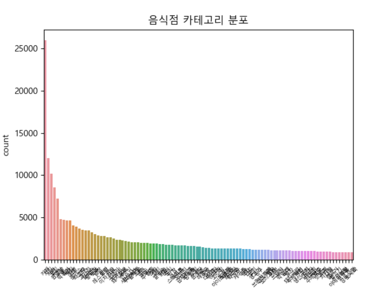
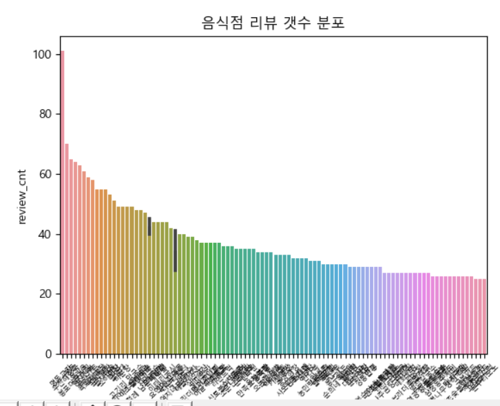
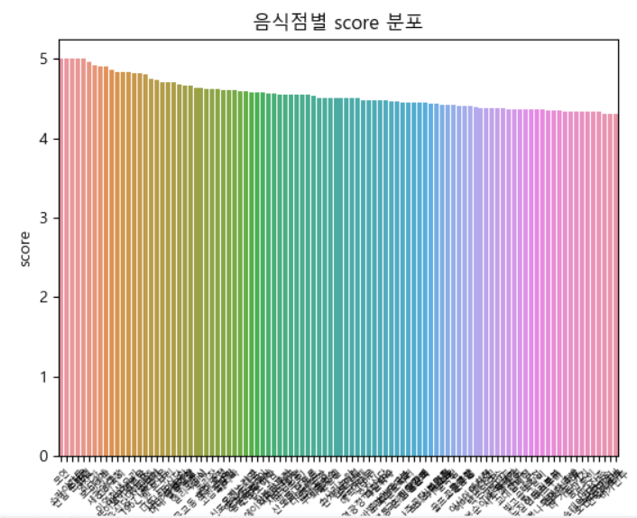
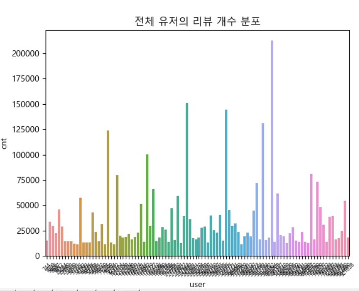
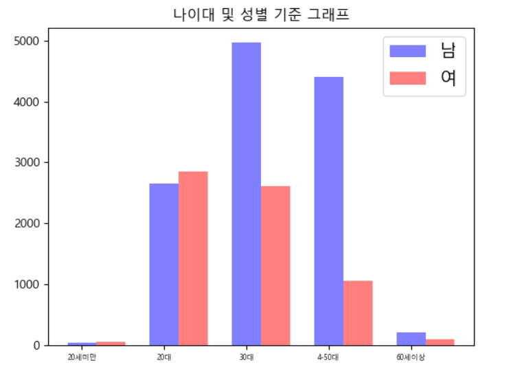
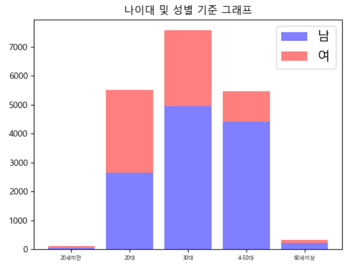
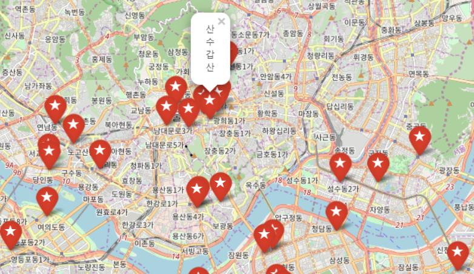

# Sub1 결과보고

## parse.py

### 1. db 스키마 작성

```python
import json
import pandas as pd
import os
import shutil

DATA_DIR = "../data"
DATA_FILE = os.path.join(DATA_DIR, "data.json")
DUMP_FILE = os.path.join(DATA_DIR, "dump.pkl")

store_columns = (
    "id",  # 음식점 고유번호
    "store_name",  # 음식점 이름
    "branch",  # 음식점 지점 여부
    "area",  # 음식점 위치
    "tel",  # 음식점 번호
    "address",  # 음식점 주소
    "latitude",  # 음식점 위도  # 위치기반 음식점 추천할 때 사용
    "longitude",  # 음식점 경도  # 위치기반 음식점 추천할 때 사용
    "category",  # 음식점 카테고리
    "review_cnt",  # 리뷰 갯수
)

menu_colums = (
    "store",  # 음식점 고유번호
    "menu",  # 메뉴 이름
    "price",  # 메뉴 가격
)

hour_colums = (
    "type",  # 영업시간 종류
    "week_type",  # 주단위 종류
    "store",  # 음식점 고유번호
    "mon",  # 월요일 포함유무
    "tue",  # 화요일 포함유무
    "wed",  # 수요일 포함유무
    "thu",  # 목요일 포함유무
    "fri",  # 금요일 포함유무
    "sat",  # 토요일 포함유무
    "sun",  # 일요일 포함유무
    "start_time",  # 시작시간
    "end_time",  # 종료시간
    "etc",  # 기타
)

review_columns = (
    "id",  # 리뷰 고유번호
    "store",  # 음식점 고유번호
    "user",  # 유저 고유번호
    "score",  # 평점
    "content",  # 리뷰 내용
    "reg_time",  # 리뷰 등록 시간
)

user_colums = (
    "id",  # 유저 고유번호
    "gender",  # 성별
    "born_year"  # 태어난 해
)
```


### 2. import data

```python
def import_data(data_path=DATA_FILE):
    """
    Req. 1-1-1 음식점 데이터 파일을 읽어서 Pandas DataFrame 형태로 저장합니다
    """

    try:
        with open(data_path, encoding="utf-8") as f:
            data = json.loads(f.read())
    except FileNotFoundError as e:
        print(f"`{data_path}` 가 존재하지 않습니다.")
        exit(1)

    stores = []  # 음식점 테이블
    menus = []  # 메뉴 테이블
    hours = []  # 음식점 시간 테이블
    reviews = []  # 리뷰 테이블
    users = []  # 유저 테이블

    for d in data:

        categories = [c["category"] for c in d["category_list"]]
        # db스키마랑 순서 일치해야함!
        stores.append(
            [
                d["id"],
                d["name"],
                d["branch"],
                d["area"],
                d["tel"],
                d["address"],
                d["latitude"],
                d["longitude"],
                "|".join(categories),
                d["review_cnt"],
            ]
        )

        for menu in d["menu_list"]:
            menus.append(
                [d["id"], menu["menu"], menu["price"]]
            )
        
        for hour in d["bhour_list"]:
            hours.append(
                [
                    hour["type"], hour["week_type"], d["id"],
                    hour["mon"], hour["tue"], hour["wed"], hour["thu"],
                    hour["fri"], hour["sat"], hour["sun"],
                    hour["start_time"], hour["end_time"], hour["etc"]
                ]
            )
  
        for review in d["review_list"]:
            r = review["review_info"]
            u = review["writer_info"]

            reviews.append(
                [r["id"], d["id"], u["id"], r["score"], r["content"], r["reg_time"]]
            )

            users.append(
                [u["id"], u["gender"], u["born_year"]]
            )

    store_frame = pd.DataFrame(data=stores, columns=store_columns)
    menu_frame = pd.DataFrame(data=menus, columns=menu_colums)
    hour_frame = pd.DataFrame(data=hours, columns=hour_colums)
    review_frame = pd.DataFrame(data=reviews, columns=review_columns)
    user_frame = pd.DataFrame(data=users, columns=user_colums)

    return {"stores": store_frame, "menus": menu_frame, "hours": hour_frame,
            "reviews": review_frame, "users": user_frame}
```


### 2. dump_dataframes

```python
def dump_dataframes(dataframes):
    pd.to_pickle(dataframes, DUMP_FILE)

def load_dataframes():
    return pd.read_pickle(DUMP_FILE)
```

- pickle형태로 저장


### 3. 결과

```tex
[음식점]
----------------------------------------------------------------------------------------------

   id     store_name branch  area  ...   latitude   longitude   category review_cnt
0   1           Agal   None    홍대  ...  37.556862  126.926666   아구찜|포장마차          0   
1   2         Assisy   None    광주  ...  35.150746  126.890062         카페          0        
2   3  Battered Sole   None   이태원  ...  37.535032  126.991664    피쉬앤칩스|펍          0   
3   4      Chakyoung   None  달맞이길  ...  35.158587  129.175004  레스토랑|카프레제          0
4   5       Delabobo   None   발산역  ...  37.559904  126.840512  디저트카페|디저트          0 

[5 rows x 10 columns]

---------------------------------------------------------------------------------------------- 


[메뉴]
---------------------------------------------------------------------------------------------- 

   store                  menu    price
0      3  메인 (피쉬앤칩스, 오리 가슴살 등)  14000.0
1      3          스타터 보드(파테 등)  18000.0
2      3        디저트 (초콜렛 퐁당 등)   8500.0
3      3               생과일 칵테일   9000.0
4      3                   생맥주   7000.0

---------------------------------------------------------------------------------------------- 


[영업시간]
---------------------------------------------------------------------------------------------- 

   type  week_type  store  mon  tue  wed  thu  fri  sat  sun start_time  end_time etc
0     1          1      3  0.0  0.0  0.0  0.0  0.0  0.0  1.0   17:30:00  23:30:00
1     3          1      3  1.0  0.0  0.0  0.0  0.0  0.0  0.0   00:00:00  00:00:00
2     1          1      3  0.0  1.0  1.0  1.0  0.0  0.0  0.0   17:30:00  23:30:00
3     1          1      3  0.0  0.0  0.0  0.0  1.0  1.0  0.0   17:30:00  24:00:00
4     1          1      7  1.0  1.0  1.0  1.0  1.0  1.0  1.0   09:00:00  23:00:00

---------------------------------------------------------------------------------------------- 


[리뷰]
---------------------------------------------------------------------------------------------- 

   id  store  ...                                            content             reg_time
0   1     15  ...         전포 윗길에 새로 생긴! 호주에서 온 쉐프가 직접 요리하는 호주식 레스토
랑!  1970-01-01 00:00:00
1   2     18  ...                    샌드위치 내용물도 알차게 들어있고 맛있었어요 가성비 추천  
1970-01-01 00:00:00
2   3     19  ...  홈플러스 1층 매장 푸드코트 내 있는 매장인데 계란찜정식은 처음보고 시켜봣는데
 사진...  1970-01-01 00:00:00
3   4     37  ...  전 여기 5년전에 가봤었는데 그때 기억은 별로였어요\n단체손님이 많았고, 차려지
는건...  1970-01-01 00:00:00
4   5     38  ...  친구들끼리 술 간단하게마시러 감. 스끼다시 괜찮지만 회 양이 조금 부족한 느낌. 맛...  2019-03-15 22:16:47

[5 rows x 6 columns]

---------------------------------------------------------------------------------------------- 


[유저]
---------------------------------------------------------------------------------------------- 

       id gender born_year
0   68632      남      1990
1  389728      여      1993
2   68716      여      1984
3  774353      여      1972
4  115682      남      1991

---------------------------------------------------------------------------------------------- 
```


<hr>

## analyze.py

### 1.  음식점 평균 평점 순(리뷰 개수가 `min_reviews` 미만인 음식점은 제외)

```python
def sort_stores_by_score(dataframes, n=30, min_reviews=30):
    # stores 테이블의 id와 reviews테이블의 store번호가 동일하게 병합
    stores_reviews = pd.merge(
        dataframes["stores"], dataframes["reviews"], left_on="id", right_on="store"
    )
    
    # null 값을 평균값으로 채워줌
    scores_group = stores_reviews.groupby(["store", "store_name"]).mean()
    
    # 평균 평점 기준 높은 평점 음식점 순으로 정렬
    scores = scores_group.groupby(["store_name"]).mean().sort_values(by=["score"], ascending=False)
    
    # 리뷰 개수가 min_reviews 미만 음식점 제외
    # astype(float)로 바꿀 필요가 없다 -> why? json은 int는 int대로,string은 string대로 인식
    scores = scores[scores["review_cnt"]>=30]

    # reset_index(): 인덱스 리셋 -> 새로운 단순한 정수 인덱스 세팅
    # reset_index() 작성하지 않으면 결과 보여줄 때, 인덱스가 아예 존재하지 않음
    return scores.head(n=n).reset_index()

```

```tex
[최고 평점 음식점]
----------------------------------------------------------------------------------------------

1위: 더아리엘(4.818181818181818점)
2위: 동원집(4.366666666666666점)
3위: 봉브레드(4.266666666666667점)
4위: 사모님돈가스(4.25점)
5위: 명동교자(4.2476770753998485점)
6위: 고기리 막국수(4.244897959183674점)
7위: 중앙해장(4.212121212121212점)
8위: 명진전복(4.180327868852459점)
9위: 우진해장국(4.1점)
10위: 라멘트럭(4.083333333333333점)
11위: 스시로로(4.083333333333333점)
12위: 우래옥(4.083333333333333점)
13위: 육회자매집(4.068965517241379점)
14위: 우동 카덴(4.03125점)
15위: 을지면옥(3.981818181818182점)
16위: 오는정김밥(3.9411764705882355점)
17위: 조점례 남문피순대(3.872340425531915점)
18위: 자매국수(3.8180555555555555점)
19위: 산수갑산(3.8157894736842106점)
20위: 반룡산(3.787878787878788점)
21위: 미미면가(3.7837837837837838점)
22위: 신다신(3.6857142857142855점)
23위: 알베르(3.6774193548387095점)
24위: 가시아방(3.6666666666666665점)
25위: 순희네 빈대떡(3.6666666666666665점)
26위: 요멘야 고에몬(3.5454545454545454점)
27위: 소문난감자탕(3.5428571428571427점)
28위: 송죽장(3.5점)
29위: 봉포머구리집(3.484375점)
30위: 목향원(3.3666666666666667점)

---------------------------------------------------------------------------------------------- 
```


### 2. 가장 많은 리뷰를 받은 음식점 정렬

```python
def get_most_reviewed_stores(dataframes, n=20):
    stores_hours = pd.merge(
        dataframes["stores"], dataframes["hours"], left_on="id", right_on="store"
    )

    reviews_group = stores_hours.groupby(['store_name', 'store']).mean()

    # 리뷰 수 기준으로 정렬
    review_cnt = reviews_group.groupby(["store_name"]).mean().sort_values(by=["review_cnt"], ascending=False)

    return review_cnt.head(n=n).reset_index()
```

```tex
[가장 많은 리뷰를 받은 음식점]
----------------------------------------------------------------------------------------------

   store_name        id  review_cnt      type  ...       thu       fri       sat   sun
0       우진해장국  309336.0   70.000000  1.000000  ...  1.000000  1.000000  1.000000  1.00    
1      봉포머구리집  187601.0   64.000000  1.000000  ...  1.000000  1.000000  1.000000  1.00   
2        명진전복  147432.0   61.000000  2.000000  ...  0.500000  0.500000  0.500000  0.50     
3       육회자매집  319442.0   58.000000  1.666667  ...  0.666667  0.666667  0.666667  1.00    
4        을지면옥  321485.0   55.000000  2.000000  ...  0.500000  0.500000  0.500000  1.00     
5     고기리 막국수   26012.0   49.000000  2.000000  ...  0.500000  0.500000  0.500000  0.50   
6   조점례 남문피순대  353580.0   47.000000  1.000000  ...  0.333333  0.666667  0.333333  0.00 
7     요멘야 고에몬  303270.0   44.000000  1.000000  ...  1.000000  1.000000  1.000000  1.00   
8        명동교자  145031.0   39.666667  1.000000  ...  1.000000  1.000000  1.000000  1.00     
9         우래옥  305905.5   38.500000  2.000000  ...  0.500000  0.500000  0.500000  0.25      
10       미미면가  157310.0   37.000000  1.000000  ...  0.500000  0.500000  0.500000  1.00     
11       스시로로  241525.0   36.000000  1.000000  ...  1.000000  1.000000  1.000000  1.00     
12    신토불이떡볶이  253450.0   36.000000  1.000000  ...  1.000000  1.000000  1.000000  1.00  
13       라멘트럭  118362.0   36.000000  1.000000  ...  1.000000  1.000000  1.000000  1.00     
14       쉑쉑버거  239919.5   36.000000  1.000000  ...  1.000000  1.000000  1.000000  1.00     
15        신다신  249091.0   35.000000  1.000000  ...  1.000000  1.000000  1.000000  1.00      
16      오는정김밥  288945.0   34.000000  2.000000  ...  0.500000  0.500000  0.500000  1.00    
17        송죽장  232883.0   34.000000  1.000000  ...  1.000000  1.000000  1.000000  1.00      
18       더아리엘   90781.0   33.000000  1.400000  ...  0.600000  0.600000  0.200000  0.20     
19       중앙해장  359300.0   33.000000  1.000000  ...  0.500000  0.500000  0.500000  1.00     

[20 rows x 12 columns]
---------------------------------------------------------------------------------------------- 
```


### 3. 가장 많은 리뷰를 작성한 유저 정렬

```python
def get_most_active_users(dataframes, n=100):
    # users와 reviews를 병합
    # 이때 users_reviews가 아닌 reviews_users로 병합하면 똑같은 리뷰가 엄청 여러개 나옴
    users_reviews = pd.merge(
        dataframes["users"], dataframes["reviews"], left_on="id", right_on="user"
    )

    users_reviews["cnt"] = 1
    # print(users_reviews.head())
    
    user_group = users_reviews.groupby('user').cnt.sum().to_frame()
    split_by_user = user_group.sort_values(by=["cnt"],ascending=False)

    return split_by_user.head(n=n).reset_index()
```

```tex
[가장 많은 리뷰를 작성한 유저]
----------------------------------------------------------------------------------------------

      user     cnt
0   469245  212521
1   243883  151321
2   328775  144400
3   391794  131044
4    74999  123904
..     ...     ...
95   30101   12100
96   31285   11881
97   82952   11664
98   71205   11664
99  372209   11664

[100 rows x 2 columns]
```

<hr>

## visualize.py

### 1.  전체 음식점의 상위 100개 카테고리 분포

```python
def show_store_categories_graph(dataframes, n=100):
    stores = dataframes["stores"]

    # 모든 카테고리를 1차원 리스트에 저장합니다
    categories = stores.category.apply(lambda c: c.split("|"))
    categories = itertools.chain.from_iterable(categories)

    # 카테고리가 없는 경우 / 상위 카테고리를 추출합니다
    categories = filter(lambda c: c != "", categories)
    categories_count = Counter(list(categories))
    best_categories = categories_count.most_common(n=n)
    df = pd.DataFrame(best_categories, columns=["category", "count"]).sort_values(
        by=["count"], ascending=False
    )

    # 그래프로 나타냅니다
    chart = sns.barplot(x="category", y="count", data=df)
    chart.set_xticklabels(chart.get_xticklabels(), rotation=45)
    plt.title("음식점 카테고리 분포")
    plt.show()
```




### 2. 전체 음식점의 리뷰 개수 분포

```python
def show_store_review_distribution_graph(dataframes,n=100):
    # 음식점 정보를 가지고와서
    stores = dataframes["stores"]

    # review_cnt가 많은 순으로 보이기
    df = pd.DataFrame(stores, columns=["store_name", "review_cnt"]).sort_values(
        by=["review_cnt"], ascending=False
    )

    # 100개만 사용(용량이 너무 크기때문)
    store_data = df.head(n=n)

    # 음식점 정보 중 review_cnt를 가지고 그래프에 나타냄
    chart = sns.barplot(x="store_name", y="review_cnt", data=store_data)
    chart.set_xticklabels(chart.get_xticklabels(), rotation=45)  # rotation: x축 라벨 45도회전
    plt.title("음식점 리뷰 갯수 분포")
    plt.show()
```




### 3. 음식점의 평균 평점 그래프

```python
def show_store_average_ratings_graph(dataframes, n=100):
    # 음식점 table + 리뷰 table
    stores_reviews = pd.merge(
        dataframes["stores"], dataframes["reviews"], left_on="id", right_on="store"
    )

    # 평균 평점 기준 높은 평점 음식점 순으로 정렬
    scores_group = stores_reviews.groupby(["store", "store_name"]).mean()
    scores = scores_group.groupby(["store_name"]).mean().sort_values(by=["score"], ascending=False).reset_index()
        #.reset_index()를 안붙이니까 store_name이 index로 가서 store_name열에 NaN으로 나옴

    # 리뷰 개수가 min_reviews 미만 음식점 제외 -> 리뷰 수가 1개인데 5.0인 경우 너무 많다
    scores = scores[scores["review_cnt"]>=10]
    
    # score평균을 낸 table 기준으로 score가 높은 순으로 보이기
    df = pd.DataFrame(scores, columns=["store_name","score"])

    # 100개만 사용
    store_data = df.head(n=n)

    # 음식점 정보 중 score를 가지고 그래프에 나타냄
    chart = sns.barplot(x="store_name", y="score", data=store_data)
    chart.set_xticklabels(chart.get_xticklabels(), rotation=45)
    plt.title("음식점별 score 분포")
    plt.show()
```




### 4. 전체 유저의 리뷰 개수 분포 그래프

```python
def show_user_review_distribution_graph(dataframes, n=100):
    users_reviews = pd.merge(
        dataframes["users"], dataframes["reviews"], left_on="id", right_on="user"
    )

    users_reviews["cnt"] = 1
    # print(users_reviews.head())
    
    user_group = users_reviews.groupby('user').cnt.sum().to_frame()
    split_by_user = user_group.sort_values(by=["cnt"],ascending=False)

    # 100개만 사용
    split_by_user = split_by_user.head(n=n).reset_index()
    # print(user_group_data.head())

    # 음식점 정보 중 score를 가지고 그래프에 나타냄
    chart = sns.barplot(x="user", y="cnt", data=split_by_user)
    chart.set_xticklabels(chart.get_xticklabels(), rotation=45)
    plt.title("전체 유저의 리뷰 개수 분포")
    plt.show()
```




### 5. 전체 유저의 성별/나이대 분포 그래프

```python
def show_user_age_gender_distribution_graph(dataframes, n=100):
    # 유저 table 가지고오기
    users = dataframes["users"]  # 성별: 남, 여, 나이대: 태어난해
    # 중복 삭제
    users = users.drop_duplicates(["id"], keep='first')
    
    # 1. 나이대 지정하기
    # 1-1. 나이 표현하기(현재년도-born_year+1해서 나이 계산)
    now = dt.now()
    this_year = now.strftime('%Y')
    this_year = int(this_year)
    users["born_year"] = users["born_year"].astype(int)
    users["age"] = this_year - users["born_year"] + 1  # int
    
    # # 1-2. 나이대 분류 (ex. 31,28과 같은 숫자로 나이대 구분)
    # # 이렇게 하면 맨 처음나오는 사람의 나이대가 처음부터 끝까지 작성됨
    # def classify_age(data):
    #     for a in data["age"]:
    #         if 10 <= a < 20:
    #             return "10대"
            
    #         elif 20 <= a < 30:
    #             return "20대"

    #         elif 30 <= a < 40:
    #             return "30대"

    #         elif 40 <= a < 50:
    #             return "40대" 

    #         elif 50 <= a:
    #             return "50대 이상"

    # users["age_category"] = classify_age(users)

    #bins = [0, 19, 29, 39, 59, 100]
    bins_names = ["20세미만","20대","30대","4-50대","60세이상"]

    users["age_category"] = pd.cut(users["age"], bins, labels=bins_names)
    print(users.head(n=20))

    # 2. 그래프 그리기 x=나이대, y=성별
    df = pd.DataFrame(users, columns=["gender","age_category"])
    # # print(df.head(n=5))
    # # 2-1. 나이대별로 그룹짓기
    sum_by_age_male = users[users['gender']=="남"].groupby("age_category").age.count()
    sum_by_age_female = users[users['gender']=="여"].groupby("age_category").age.count()
    # print(sum_by_age_male.head())
    # print('---------------------------------------')
    # print(sum_by_age_female.head())

    # # 2-2-1. 나이대 및 성별 기준 그래프그리기(x축 나이대, 하나의 나이대에 두줄로 남, 여 표시)
    index = np.arange(5)
    bar_width = 0.35
    alpha = 0.5
    p1 = plt.bar(index, sum_by_age_male, bar_width,color="b", alpha=alpha,label="남")
    p2 = plt.bar(index+bar_width, sum_by_age_female, bar_width,color="r", alpha=alpha,label="여")

    plt.title("나이대 및 성별 기준 그래프")
    labels=["20세미만","20대","30대","4-50대","60세이상"]
    plt.xticks(index, labels)
    plt.legend((p1[0], p2[0]), ('남', '여'), fontsize=15)
    plt.show()

    # 2-2-2. 나이대 및 성별 기준 그래프그리기(x축 나이대, 하나의 나이대에 남, 여 쌓기)
    labels=["20세미만","20대","30대","4-50대","60세이상"]
    index = np.arange(5)
    alpha = 0.5

    p11 = plt.bar(index, sum_by_age_male,color="b", alpha=alpha)
    p22 = plt.bar(index, sum_by_age_female,color="r",
                alpha=alpha,bottom=sum_by_age_male)

    plt.title("나이대 및 성별 기준 그래프")
    labels=["20세미만","20대","30대","4-50대","60세이상"]
    plt.xticks(index, labels)
    plt.legend((p11[0], p22[0]), ('남', '여'), fontsize=15)
    plt.show()
```

<버전1>


<버전2>




### 6. 음식점의 위치 분포를 지도에 표시

```python
def show_stores_distribution_graph(dataframes, n=100):
    stores = dataframes["stores"]
    
    # 위치 분포 지정
    '''
    <지도에 나타내는건지 모르고..>
    1. 특별시 기준으로 나눴을때 어쨋든 큰단위를 기준으로함. 
        sum_by_address = stores.groupby("address_data").sum() 이거로하니까 412개 나오는데 주소입력이 제각각이라 아예 area해서 거기서 구분해서 구단위 등으로 하는게 나을듯
    '''

    # 1. 가게이름, 위도, 경도를 가지고 지도에 표시
    stores = stores[["store_name", "latitude", "longitude", "review_cnt"]].sort_values(
        by=["review_cnt"], ascending=False
    ).reset_index()
    
    stores = stores.head(n=50)

    # 2. 지도 시각화
    map = folium.Map(location=[37.5642135,127.0016985], zoom_start=12)

    # 3. 지도에 리뷰갯수 상위 50개 표시
    for store in stores.index:
        lati = stores.loc[store, "latitude"]
        longi = stores.loc[store, "longitude"]

        folium.CircleMarker([lati, longi], radius=stores.loc[store, "review_cnt"]/5,
                            popup=stores.loc[store,"store_name"],color='blue',
                            fill=True).add_to(map)
    map.save('map.html')
```

