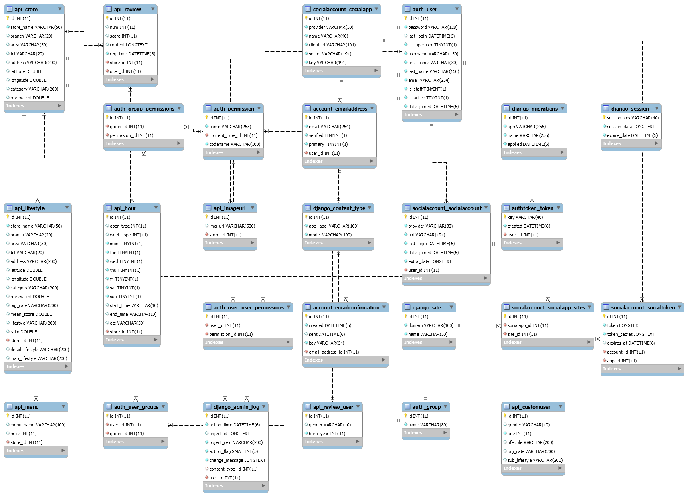

# 처음 세팅시

0. DB는 우분투에 올라가 있어서 설정 안해도 됨 (궁금하면 settings.py 열어보고 문의)
1. 3.6.8 가상환경 잡기 
2. pip install -r requirements.txt 
3. python manage.py runserver # 서버 구동

# 이후

3. 127.0.0.1:8000/swagger/   # rest-api확인
4. 127.0.0.1:8000/api/    # dining code data 들어있는 곳
5. 127.0.0.1:8000/social/google/login/  # 소셜 로그인 일단 구현, callback url과 권한설정 프론트와 합의 후 다시 할것임
6. 127.0.0.1:8000/rest-auth/registration/ # 회원가입 api - 단, settings.py에서 Debug=False 설정해야 서버 오류 안뜸
7. 127.0.0.1:8000/rest-auth/login[또는 logout]/ # 로그인, 로그아웃 담당 라이브러리 - jwt token 기반 : admin 페이지에서 확인 가능
8. superuser 만들어져 있음 - 127.0.0.1:8000/admin/ 에서 아래 정보로 로그인
id : scarlet
pass : scarletscarlet


### ERD



# BACK API 정리

1. (GET)/api/stores 

   ```
   전체 stores 반환 (lifestyle로 분류된 9600여개의 상점정보, 임의로 정렬)
   ```

2. (GET)/api/lifestyle : # search

   ```
   search - lifestyle(고기압승파, 등) 검색
   (해당 라이프스타일과 적합도 높은 순으로 상점들 정렬되어 있음)
   ```

3. (GET)/api/lifestylePK : # search

   ```
   search - 디테일 정보 call할 객체의 store 번호(id 아님) 넣으면 디테일 페이지 위한 객체 나옴 
   (예시 : store 번호 121216을 search에 넣으면 store_name이 레이어드)
   ```

4. (GET)/api/storebyarea :  # search

   ```
   search - area별 (ex) 서울용산구
   ```

5. (GET)/api/storebycate : # search

   ```
   search - big_cate별 (ex) 한식
   ```

6. (GET)/api/menus :

   ```
   search - 객체의 store 번호 넣으면 해당 가게의 메뉴들 리턴
   ```

7. (GET)/api/hours 

   ```
   search - 객체의 store 번호 넣으면 해당 가게들의 시간 리턴(요일별로 0,1 로 처리됨 유의)
   ```

8. (GET)/api/reviews - 

   ```
   search - 객체의 store 번호 넣으면 해당 가게의 리뷰들 리턴
   ```

9. (GET)/api/map : 

   ```
   search - lifestyle, big_cate, 지역 조건에 가장 부합하는 8~10개의 상점 검색 (ex) 점심!분식!용산구
   ```

10. (GET, POST)/api/customuser - 회원가입시 라이프스타일 받을 객체

    ```
    post 요청으로 유저 정보 만들고,  (GET)/api/customuser/{user_id} 로 유저정보 검색
    ```

    ---

    #####  아래는 아직 데이터 저장 안됐음, 되면 말할게용 

    1. (GET)/api/imageurl - 원하는 store_id 집어넣으면 해당 가게의 이미지 url 리턴 # 아직 데이터 안넣음
    2. lifestyle 정렬 - 지역, 평균평점 높은 순 등 # 나중에 만들것임

    ---


### FOR DETAIL PAGE

1. (GET)/api/lifestylePK : search - store_id 
2. (GET)/api/menus : search - store_id 
3. (GET)/api/hours: search - store_id 
4. (GET)/api/reviews : search - store_id 

5. (GET)/api/imageurl : search - store_id 


### FOR MAP PAGE

1. (GET)/api/map : search - 가장 부합하는 8~10개의 상점 검색 (ex) 점심!분식!용산구
2. (GET)/api/lifestylePK : search - store_id 넣으면 디테일 페이지 위한 객체 나옴
3. (GET)/api/imageurl : search - 원하는 store_id 집어넣으면 해당 가게의 이미지 URL 콜


### FOR USER PAGE

1.  (POST)/api/customuser
2.  (GET)/api/customuser/{user_id}


# 전부 로컬로 돌려놓기
1. settings에 db부분
2. save~부분에 pysql부분