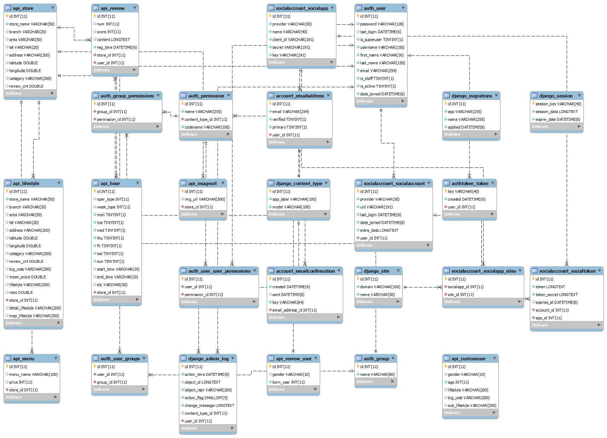

# BACK API 정리

1. (GET)/api/stores 

   ```
   전체 stores 반환 (lifestyle로 분류된 9600여개의 상점정보, 임의로 정렬)
   ```

2. (GET)/api/lifestyle : # search

   ```
   search - lifestyle(고기압승파, 등) 검색
   (해당 라이프스타일과 적합도 높은 순으로 상점들 정렬되어 있음)
   ```

3. (GET)/api/lifestylePK : # search

   ```
   search - 디테일 정보 call할 객체의 store 번호(id 아님) 넣으면 디테일 페이지 위한 객체 나옴 
   (예시 : store 번호 121216을 search에 넣으면 store_name이 레이어드)
   ```

4. (GET)/api/storebyarea :  # search

   ```
   search - area별 (ex) 서울용산구
   ```

5. (GET)/api/storebycate : # search

   ```
   search - big_cate별 (ex) 한식
   ```

6. (GET)/api/menus :

   ```
   search - 객체의 store 번호 넣으면 해당 가게의 메뉴들 리턴
   ```

7. (GET)/api/hours 

   ```
   search - 객체의 store 번호 넣으면 해당 가게들의 시간 리턴(요일별로 0,1 로 처리됨 유의)
   ```

8. (GET)/api/reviews - 

   ```
   search - 객체의 store 번호 넣으면 해당 가게의 리뷰들 리턴
   ```

9. (GET)/api/map : 

   ```
   search - lifestyle, big_cate, 지역 조건에 가장 부합하는 8~10개의 상점 검색 (ex) 점심!분식!용산구
   ```

10. (GET, POST)/api/customuser - 회원가입시 라이프스타일 받을 객체

    ```
    post 요청으로 유저 정보 만들고,  (GET)/api/customuser/{user_id} 로 유저정보 검색
    ```

    ---

    #####  아래는 아직 데이터 저장 안됐음, 되면 말할게용 

    1. (GET)/api/imageurl - 원하는 store_id 집어넣으면 해당 가게의 이미지 url 리턴 # 아직 데이터 안넣음
    2. lifestyle 정렬 - 지역, 평균평점 높은 순 등 # 나중에 만들것임

    ---


### FOR DETAIL PAGE

1. (GET)/api/lifestylePK : search - store_id 
2. (GET)/api/menus : search - store_id 
3. (GET)/api/hours: search - store_id 
4. (GET)/api/reviews : search - store_id 

5. (GET)/api/imageurl : search - store_id 


### FOR MAP PAGE

1. (GET)/api/map : search - 가장 부합하는 8~10개의 상점 검색 (ex) 점심!분식!용산구
2. (GET)/api/lifestylePK : search - store_id 넣으면 디테일 페이지 위한 객체 나옴
3. (GET)/api/imageurl : search - 원하는 store_id 집어넣으면 해당 가게의 이미지 URL 콜


### FOR USER PAGE

1.  (POST)/api/customuser
2.  (GET)/api/customuser/{user_id}


### ERD


<hr>

## Data 정리

### DATA_big_cate

1. 카페
2. 한식
3. 돈가스, 회, 일식
4. 고기
5. 술
6. 중식
7. 치킨
8. 버거
9. 분식
10. 아시안요리
11. 족발
12. 피자, 파스타, 스테이크


### DATA_lifestyle

1. 커피 한잔의 낭만파

   ​	1) 한옥 감성 느끼고 싶다면 여기로!

   ​	2) 오늘은 브런치 어때?

   ​	3) 분위기 좋은 루프탑 카페를 찾는다면 여기지~

   ​	4) 언제먹어도 맛있는 빙수맛집~

   ​	5) 빵투어 한번 갈까요?

   ​	6) 달달한게 땡긴다? 여기로 가자!

   ​	7) 케이크 뿌수러 같이 안갈래?!

   ​	8) 핸드드롭 커피로 풍미 up~

   ​	9) 평소와 다르게 색다른 카페는 어때?!

   ​	10) 샌드위치, 토스트 맛집!

   ​	11) 맛있는 디저트로 완벽하게 마무리 가즈아~

   ​	12) 분위기 좋은 카페, 여기있지~

   ​	13) 프랜차이즈 카페모음

   ​	14) 밀크티,홍차 왤케 맛있지?!

   ​	15) 커피가 맛있는 카페!

2. 고기압승파

   ​	1) 곱창 뿌수러 가자~

   ​	2) 삼겹살은 진리아닌가요?

   ​	3) 저기압일땐 고기 앞으로!

   ​	4) 치맥 콜?!

   ​	5) 다같이 족발,보쌈 먹으러 고?

3. 리마리오 뺨치는 느끼함을 원하는 버터파

   ​	1) 파스타가 땡기네~

   ​	2) 분위기있게 파스타나 피자먹으러 안갈래?

   ​	3) 버거는 또 수제버거지~

   ​	4) 믿고 가는 버거맛집!

4. 가성비 맛집 헌터파

   ​	1) 칼국수 맛있게 먹으러 갈래?

   ​	2) 맛도 잡고 가격도 잡은 국수집~

   ​	3) 해산물로 요리한 한식집은 어때요?!

   ​	4) 해장으로도 좋고, 밥으로도 먹기 좋은 이곳!

   ​	5) 닭갈비나 찜닭 어때?

   ​	6) 따뜻하게 찌개나 전골 흡입하러 갈까?

   ​	7) 집밥같은 백반 맛집으로 가자~

   ​	8) 초밥 한판 뚝딱할래?

   ​	9) 추억의 옛날돈가스 맛집!

   ​	10) 바삭하게 맛있는 돈가스 먹으러가자~

   ​	11) 가성비 좋은 일식은 어때?!

   ​	12) 싱싱한 회 한접시 할래요?!

   ​	13) 가격 부담 적게 곱쏘 고?

   ​	14) 맛있는 고기 뿌수러 갈까?

   ​	15) 분위기도 잡고, 가격도 잡은 파스타 맛집~

   ​	16) 피자? 파스타? 다양하게 있으니 뭐든 골라!

   ​	17) 가성비 좋게 스테이크 썰러 가볼까?

   ​	18) 피자는 어때?!

5. 저녁시간, 가족과 오붓하게파

   ​	1) 든든하게 칼국수, 수제비 고?

   ​	2) 면치기 하러가자~

   ​	3) 다같이 맛있는거 먹으러갈까?

   ​	4) 시원하게 국밥한그릇?

   ​	5) 오늘은 소고기, 돼지고기 말고 닭고기?!

   ​	6) 다양한 찌개 맛집~

   ​	7) 건강하게 두부정식이나 백반 먹을래?!

   ​	8) 샤브샤브가 또 맛있죠~

   ​	9) 여기가 곱창 맛집이네~

   ​	10) 기름칠한번 하러갈래?

   ​	11) 든든하게 고기먹는건 어때요?!

   ​	12) 닭발에 소주? 아니면 맛있는 맥주?!

   ​	13) 조용하게 이자카야에서 한잔?!

   ​	14) 분위기에 취한다~

   ​	15) 얼얼하게 마라 어때? 훠궈는? 양꼬치도 맛있쥬~

   ​	16) 중식, 원하는대로 먹자~

   ​	17) 중국음식 흡입하러 갈래?

6. 부드러운 음식으로 마음을 녹일 보들파

   ​	1) 칼국수, 수제비 한그릇 하고갈까?

   ​	2) 쫄깃한 국수 먹으러 가자~

   ​	3) 탱글탱글한 해물 먹자!

   ​	4) 뜨끈한 국물 먹으러가자~

   ​	5) 닭갈비,, 찜닭,,, 너무 맛있잖아?!

   ​	6) 밥 두그릇 먹을 수 있는 맛집!

   ​	7) 백반집은 맛집이쥬~

   ​	8) 이곳이 바로 한식 맛집!

   ​	9) 쫄깃한 족발, 부드러운 보쌈 먹자!

   ​	10) 색다르게 다른 아시아국가 음식 먹어볼래?!

   ​	11) 따끈한 쌀국수와 상콤한 분짜로 힐링하자!

7. 점심 두둑히 먹어야 할 든든파

   ​	1) 든든하게 돈가스 먹고 갈래?!

   ​	2) 초밥 뿌수러 같이 안갈래?

   ​	3) 싱싱한 회가 가득한 이곳~

   ​	4) 아기자기하게 일식먹는건 어때?!

   ​	5) 떡볶이는 항상 진리죠~

   ​	6) 분식은 골라먹는 맛이쥬~

   ​	7) 버거는 또 수제버거지~

   ​	8) 믿고 가는 버거맛집!

   ​	9) 치킨은 언제 먹어도 맛있는 음식 아닌가요?!

   ​	10) 족발과 보쌈엔 막국수가 필수죠~

8. 진한 국물을 음미하는 어르신파

   ​	1) 따끈한 칼국수나 수제비 어때?

   ​	2) 호로록! 국수 한그릇 땡길까요!?

   ​	3) 해물로 요리한 한식집들!

   ​	4) 해장 아니어도 가기 좋은 음식점~

   ​	5) 닭갈비 맛있죠!

   ​	6) 뜨끈하게 밥먹자~

   ​	7) 믿고 갈 수 있는 한식집!

   ​	8) 맛있는 안주와 함께 술한잔 어때요?

   ​	9) 얼얼한 마라나 고소한 양꼬치 먹자~

   ​	10) 짜장면?! 짬뽕?! 뭐먹을래?!

